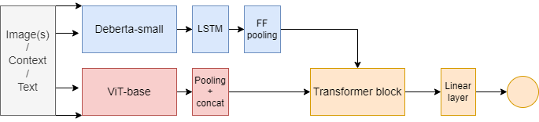

# Boost

Boost is a model that predicts the engagement (shares, likes, likelihood of going viral) that text and images will generate. Boost achieves 87-92% prediction accuracy on social media and news, and 71%–88% accuracy on internet comments, depending on the topic of discussion.

This repo includes the model and dataset for text and a JS endpoint to serve it. 

This is a partial release of the Boost models, app and dataset. Due to their size, they have to be downloaded from here:  . 

## Serving the model

To serve the model (backbone: `deberta-small`) using this code, you need to upload it to a Flask server that supports Pytorch. The endpoint is a Chrome extension that detects typing and automatically sends the content a few seconds after you stop. Inference is fast enough on a single CPU core, which can process a couple of queries per second. 

## Full model

If you want to use the full model, which processes text + images, you need to train it yourself using the scripts on the directory `full_model/` using images you scrape. You can find scraping repos on my profile. The model on the link is only the text model and is less accurate (-5% to -10%). 

## Architecture

The text model is a text transformer + a few tricks to increase accuracy. The full model has the following architecture:

## Error Analysis

### Tables

#### Full model

| Label  | Precision | Recall | f1-score | 
| ------------- | ------------- | ------------- | ------------- | 
| Bottom 50%  | 0.86  | 0.80 | 0.83 |
| Top 20%  | 0.82  | 0.86 | 0.84 |

| Register (sample) | Precision (simple average) | 
| ------------- | ------------- | 
| Web  | 0.79  | 
| Social | 0.92  |
| News/Magazine  | 0.94  | 
| Fiction  | 0.97  | 

| Topic (sample) | Precision (simple average) | 
| ------------- | ------------- | 
| Sports | 0.75  |
| Politics  | 0.88  | 
| Science  | 0.84  | 

#### Text model

| Label  | Precision | Recall | f1-score | 
| ------------- | ------------- | ------------- | ------------- | 
| Bottom 50%  | 0.80  | 0.76 | 0.78 |
| Top 20%  | 0.77  | 0.80 | 0.78  |

| Register (sample) | Precision (simple average) | 
| ------------- | ------------- | 
| Web  | 0.74  | 
| Social | 0.82  |
| News/Magazine  | 0.88  | 
| Fiction  | 0.96  | 

| Topic (sample) | Precision (simple average) | 
| ------------- | ------------- | 
| Sports | 0.73  |
| Politics  | 0.77  | 
| Science  | 0.82  | 

### Missing quintile

We only use the top 20% and bottom 50% and ask the model to create a binary boundary to predict in which bin a piece of content will fall. Experimenting with 10 bins, one for each decile (10%), I found there was great overlap among the deciles. The farther away you move from the boundary, the less likely it is the model will make mistakes. Similarly, the overlap between bottom 10% and top 10% was very low. 

Why not mark the boundary at 50%? The average 50-percenter has around 3 Reddit upvotes and a few shares on Twitter, just to give two examples--hardly what someome would consider highly performant. Further, the gap reduces the error rate (at the expense of some recall), even when you include the missing comments in the test set. The middle ground on the engagement scale is a very noisy region, where a lot of content of disputed value (such as controversial content) can be found, along with good and bad comments that didn't get enough exposure. 

An interesting option is to use a sigmoid gate instead of a linear layer so that you can define a performance boundary arbitrarily during inference.

### Sources of Error
